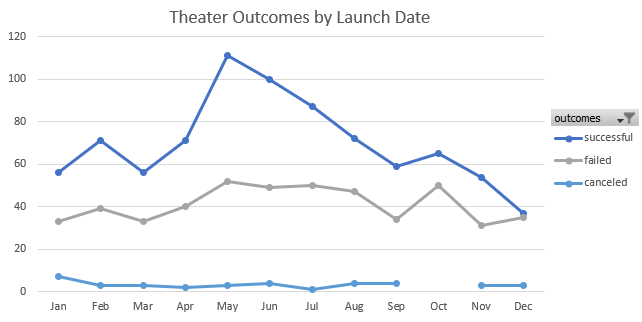

# An Analysis of Kickstarter Campaigns
Overview of the Project
The purpose of this project is to help a budding playwright, Louise, who wishes to start a crowdfunding campaign in order to put on her play, Fever. Our help comes in the form of better understanding past Kickstarter campaigns through organization, sorting, and analysis of relevant data using Microsoft Excel. In this way, we can encourage Louise to design her crowdfunding plans to mirror prior successful campaigns and have the greatest chance of raising enough money to put on her production.
---
##Analysis and Challenges---
###Firstly, I created an analysis of kickstarter outcomes based on their launch dates. In order to generate an analysis of the data based on their launch date, I created a column in the kickstarter raw data for the year each campaign was started. Armed with that, I then built a pivot table that is able to sort out theater kickstarters and organized them by the month they were started, tracking whether they were successful, failed, or were canceled. From this table, I created the following line chart that demonstrates trends in the data.---

