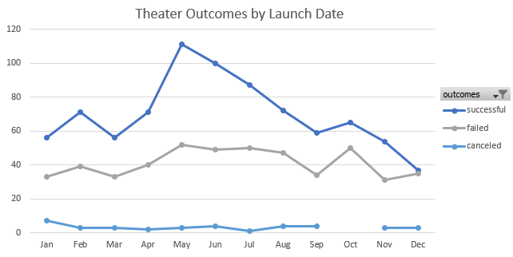
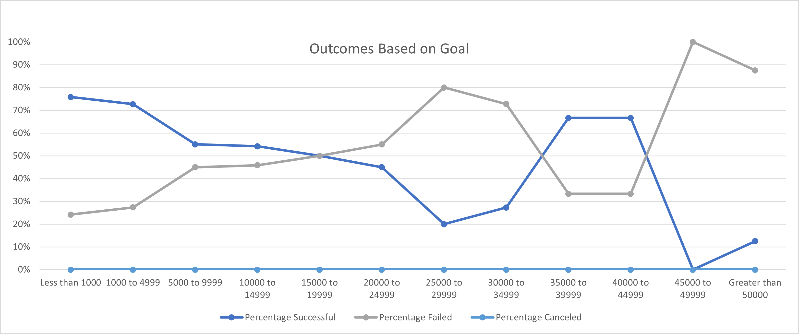

# An Analysis of Kickstarter Campaigns
## Overview of the Project
### The purpose of this project is to help a budding playwright, Louise, who wishes to start a crowdfunding campaign in order to put on her play, Fever. Our help comes in the form of better understanding past Kickstarter campaigns through organization, sorting, and analysis of relevant data using Microsoft Excel. In this way, we can encourage Louise to design her crowdfunding plans to mirror prior successful campaigns and have the greatest chance of raising enough money to put on her production. Specifically, the goal for the challenge is to produce analysis of the outcomes of past Kickstarter campaigns based on their launch dates and their goal amounts. 

## Analysis and Challenges
### Firstly, I created an analysis of Kickstarter outcomes based on their launch dates. In order to generate an analysis of the data based on their launch date, I created a column in the kickstarter raw data for the year each campaign was started. Armed with that, I then inserted a pivot table into a new worksheet entitled "Theater Outcomes by Launch Date" that filtered out theater Kickstarters and organized them by the month they were started, sorting into groups by whether they were successful, failed, or were canceled. From this table, I created the following line chart that visually demonstrates trends in the data.

### Secondly, I created an analysis of Kickstarter outcomes based on their goal amounts. With this aim in mind, I again created a new worksheet that I named "Outcomes Based on Goals." In this worksheet, I made columns for possible Kickstarter outcomes: successful, failed, and canceled. I then used the Excel COUNTIFS function to count the number of successful, failed, and canceled Kickstarters in the "plays" subcategory with various goal amount ranges, that can be seen in the line chart below. Subsequently, I used the SUM function to find the total number of Kickstarters in each goal amount range, and then found what percentage of the total number of Kickstarters were successful, failed, and canceled for each goal amount range. Finally I created the following line chart to show the data at a glance.

### Challenges that I faced with this analysis included organizing the data in the pivot table to reflect the month in which the Kickstarters were started, and using the COUNTIFS function to include all of the correct requirements for the counting. My approach to overcome these challenges was first to attempt to change the settings in the field list for the pivot table or the syntax for the function by myself. If that approach did not work, I circled back to the instructions, which luckily included helpful hints. An additional challenge that I encountered when completing this assignment, that is not related to the analysis or work in Microsoft Excel, is my lack of familiarity with GitHub, markdown syntax, and adding and updating files to repositories. I solved any problem I had here by searching Google and Youtube for the answers that I could not find, or did not understand, in the instructions in bootcampspot.com.

## Results
### From what the Theater Outcomes Based on Launch Date chart shows me, I can see that the number of cancelled theater Kickstarters is low regardless of the month it started and can conclude that the launch date is not likely to influence Louise's outcome as far as whether it is canceled or not. However, I see that there is considerable variation in both the successful and the failed campaigns throughout the year. Consequently, I can conclude that some factor about the months of May and June creates a more favorable outcome for theater Kickstarter campaigns, since those months have the highest number of past campaigns were successful, and the number of failed campaings were very similar. The Outcomes Based on Goal chart demonstrates that the goal amount ranges for plays with the highest percentage of successes are the two lowest ranges, below five thousand dollars, where the ranges closer to Louise's goal amount have close to a 55% rate of success. I can conclude that the goal amount does impact the outcome of a Kickstarter campaign, however the exact relationship is not clear from the chart. To improve our understanding, it would be helpful to conduct further analysis, such as on how the number of backers and the average pledge are related to the success of a campaign, and have additional information since the newest information is about 5 years old.
